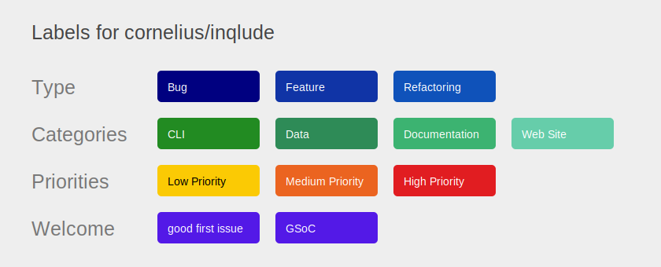
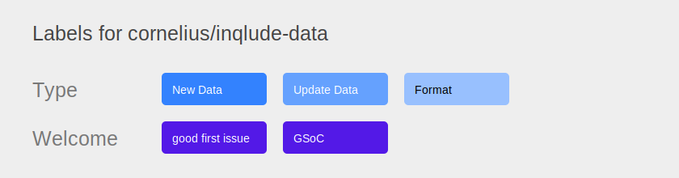

# Inqlude contribution guide

Contributions to Inqlude are very welcome. Code, information about libraries, documentation, feedback, everything helps and is very much appreciated. You can use the [Inqlude issues](https://github.com/cornelius/inqlude/issues) as a starting point to ask questions, provide input, or report bugs and feature requests. The data shown on the [Inqlude web site](http://inqlude.org/) is hosted in the [inqlude-data repository](https://github.com/cornelius/inqlude-data). Go there to submit pull requests for adding new libraries or updating existing ones, or to report any issues with the data.

This is a community project. Thanks for your participation.

## Issue labels

We use issue labels to categorize and prioritize issues. See the graphics below for an overview.

### [inqlude](https://github.com/cornelius/inqlude/labels)

### [inqlude-data](https://github.com/cornelius/inqlude-data/labels)

